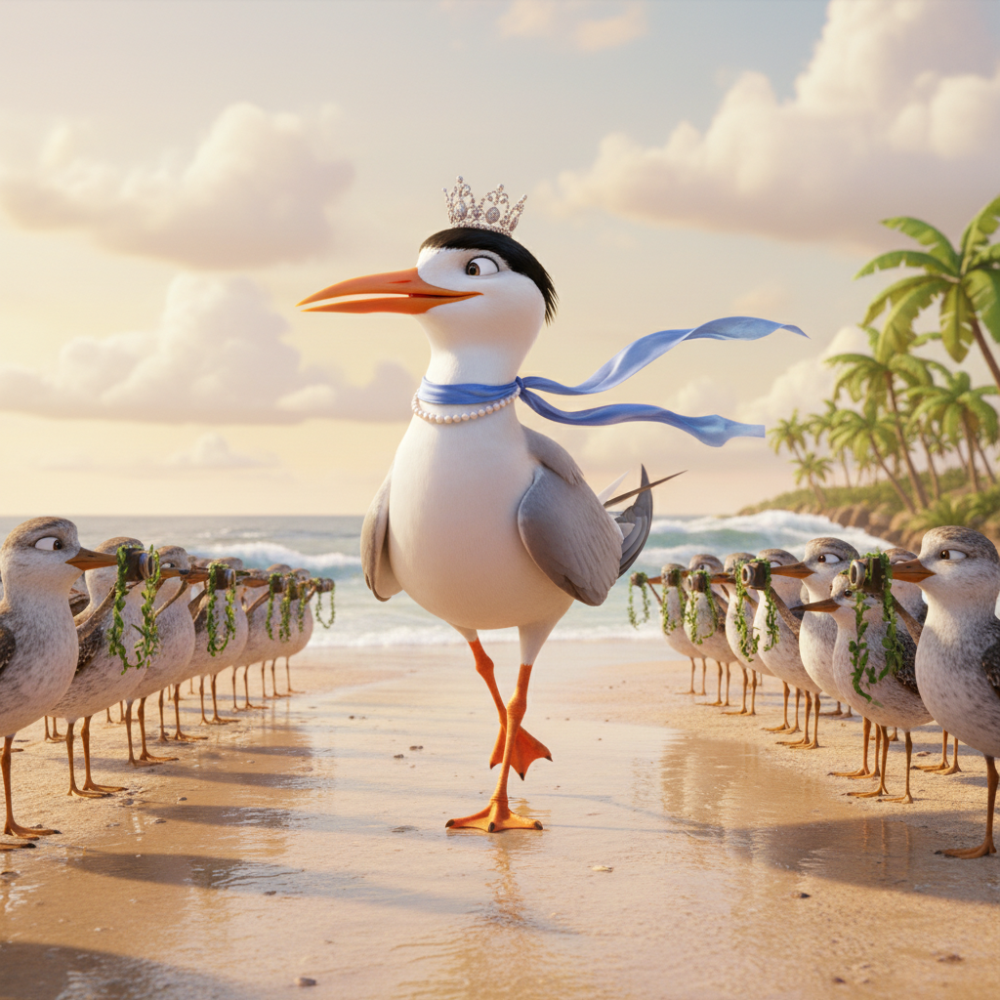
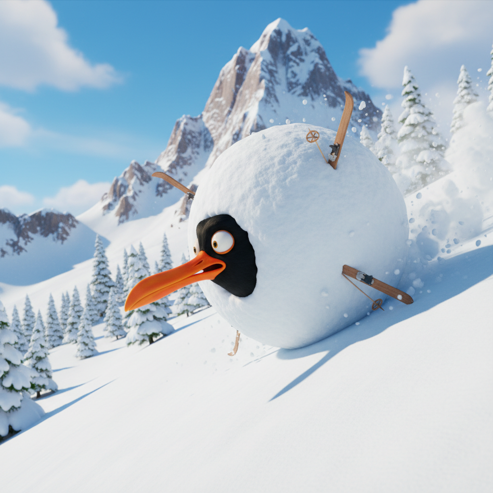

# Birdie: Beaks and giggles for the entire family

This app that takes a bird species and makes up silly stories and cartoon images to go with the stories. What is included is a UI where the user types in their prompt and sees the results. On the backend, the app connects to a Gemini powered bot. Silliness and slapstick halarity come next. There's not much more then that!

This has been programed to give the user a high degree of creative freedom in their prompts. Unless the user requests otherwise, the app will provide a story and illustration. It will keep building on that story until the user provides a different bird species or tells it to stop. It's parameters are to ensure the subject matter stays within the imaginary avian world and is safe and appropriate for the entire family.

## Run Locally

**Prerequisites:**  Node.js

1. Install dependencies:
   `npm install`
2. Set the `GEMINI_API_KEY` in [.env.local](.env.local) to your Gemini API key
3. Run the app:
   `npm run dev`

You may download the files from the latest release. Keep in mind that you need Node.js installed to run this locally on your computer.  You will also need an API key to Gemini.  I recommend you run this app first on Google AI studio and generate a key there.  

## Example Story
   
Meet Oliver the Black Oystercatcher, the only bird brave enough to enter the Winter Olympics' Extreme Downhill Slalom! Oliver was doing great, his bright orange beak slicing through the mountain air like a hot knife through butter, until he hit a particularly jumpy mogul. Instead of a majestic flight, he performed a triple-clumsy-flip and began collecting snow like a high-speed magnet! Now, Oliver isn't just a bird; he's the core of a massive, thundering snowball hurtling toward the finish line.

His tiny wooden skis are sticking out at useless angles, and his long orange beak is serving as a makeshift rudder as he bounces down the slope. The judges are confused—is it a bird? Is it a boulder? No, it's an Oystercatcher-sicle! He’s currently rolling past the bobsled track, and he’s actually on pace for a bronze medal in the 'Accidental Avalanche' category!

## Random Things To Note

For some reason, this app likes naming the avian characters Burnaby.  I've noticed it also likes marshmellows.

Birdie came about from an attempt of mine to entertain the family using AI.  The app here on GitHub is meant to be ran locally, given you create your own API key.

## Testimonials From Real Users

- This is incredable, but what's that about a Burrowing Owl doing the disco?

- LMFAO!

- The illustrations are great.
